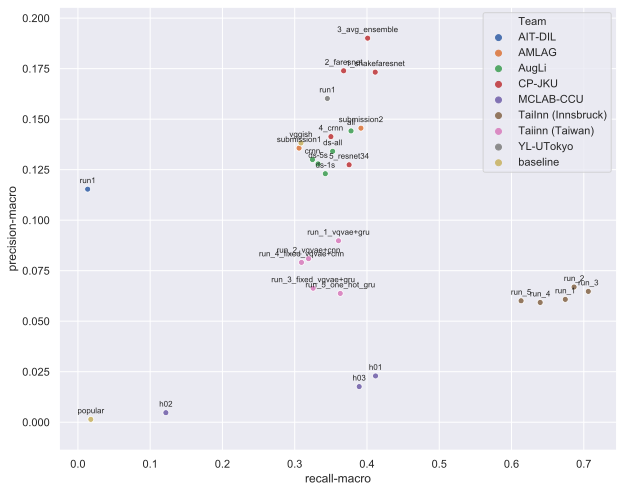

# Submission results

## Leaderboard - PR-AUC-macro

<table id="T_b05dff4a_e9dc_11e9_acef_94f6d616e838" ><thead>    <tr>        <th class="blank level0" ></th>        <th class="col_heading level0 col0" >Team</th>        <th class="col_heading level0 col1" >Run</th>        <th class="col_heading level0 col2" >PR-AUC-macro</th>        <th class="col_heading level0 col3" >ROC-AUC-macro</th>        <th class="col_heading level0 col4" >External data</th>    </tr></thead><tbody>
                <tr>
                        <th id="T_b05dff4a_e9dc_11e9_acef_94f6d616e838level0_row0" class="row_heading level0 row0" >1</th>
                        <td id="T_b05dff4a_e9dc_11e9_acef_94f6d616e838row0_col0" class="data row0 col0" >CP-JKU</td>
                        <td id="T_b05dff4a_e9dc_11e9_acef_94f6d616e838row0_col1" class="data row0 col1" >3_avg_ensemble</td>
                        <td id="T_b05dff4a_e9dc_11e9_acef_94f6d616e838row0_col2" class="data row0 col2" >0.154609</td>
                        <td id="T_b05dff4a_e9dc_11e9_acef_94f6d616e838row0_col3" class="data row0 col3" >0.772913</td>
                        <td id="T_b05dff4a_e9dc_11e9_acef_94f6d616e838row0_col4" class="data row0 col4" >-</td>
            </tr>
            <tr>
                        <th id="T_b05dff4a_e9dc_11e9_acef_94f6d616e838level0_row1" class="row_heading level0 row1" >2</th>
                        <td id="T_b05dff4a_e9dc_11e9_acef_94f6d616e838row1_col0" class="data row1 col0" >CP-JKU</td>
                        <td id="T_b05dff4a_e9dc_11e9_acef_94f6d616e838row1_col1" class="data row1 col1" >1_shakefaresnet</td>
                        <td id="T_b05dff4a_e9dc_11e9_acef_94f6d616e838row1_col2" class="data row1 col2" >0.148037</td>
                        <td id="T_b05dff4a_e9dc_11e9_acef_94f6d616e838row1_col3" class="data row1 col3" >0.771685</td>
                        <td id="T_b05dff4a_e9dc_11e9_acef_94f6d616e838row1_col4" class="data row1 col4" >-</td>
            </tr>
            <tr>
                        <th id="T_b05dff4a_e9dc_11e9_acef_94f6d616e838level0_row2" class="row_heading level0 row2" >3</th>
                        <td id="T_b05dff4a_e9dc_11e9_acef_94f6d616e838row2_col0" class="data row2 col0" >CP-JKU</td>
                        <td id="T_b05dff4a_e9dc_11e9_acef_94f6d616e838row2_col1" class="data row2 col1" >2_faresnet</td>
                        <td id="T_b05dff4a_e9dc_11e9_acef_94f6d616e838row2_col2" class="data row2 col2" >0.146333</td>
                        <td id="T_b05dff4a_e9dc_11e9_acef_94f6d616e838row2_col3" class="data row2 col3" >0.75746</td>
                        <td id="T_b05dff4a_e9dc_11e9_acef_94f6d616e838row2_col4" class="data row2 col4" >-</td>
            </tr>
            <tr>
                        <th id="T_b05dff4a_e9dc_11e9_acef_94f6d616e838level0_row3" class="row_heading level0 row3" >4</th>
                        <td id="T_b05dff4a_e9dc_11e9_acef_94f6d616e838row3_col0" class="data row3 col0" >AMLAG</td>
                        <td id="T_b05dff4a_e9dc_11e9_acef_94f6d616e838row3_col1" class="data row3 col1" >submission2</td>
                        <td id="T_b05dff4a_e9dc_11e9_acef_94f6d616e838row3_col2" class="data row3 col2" >0.125896</td>
                        <td id="T_b05dff4a_e9dc_11e9_acef_94f6d616e838row3_col3" class="data row3 col3" >0.752886</td>
                        <td id="T_b05dff4a_e9dc_11e9_acef_94f6d616e838row3_col4" class="data row3 col4" >-</td>
            </tr>
            <tr>
                        <th id="T_b05dff4a_e9dc_11e9_acef_94f6d616e838level0_row4" class="row_heading level0 row4" >5</th>
                        <td id="T_b05dff4a_e9dc_11e9_acef_94f6d616e838row4_col0" class="data row4 col0" >YL-UTokyo</td>
                        <td id="T_b05dff4a_e9dc_11e9_acef_94f6d616e838row4_col1" class="data row4 col1" >run1</td>
                        <td id="T_b05dff4a_e9dc_11e9_acef_94f6d616e838row4_col2" class="data row4 col2" >0.125564</td>
                        <td id="T_b05dff4a_e9dc_11e9_acef_94f6d616e838row4_col3" class="data row4 col3" >0.753199</td>
                        <td id="T_b05dff4a_e9dc_11e9_acef_94f6d616e838row4_col4" class="data row4 col4" >-</td>
            </tr>
            <tr>
                        <th id="T_b05dff4a_e9dc_11e9_acef_94f6d616e838level0_row5" class="row_heading level0 row5" >6</th>
                        <td id="T_b05dff4a_e9dc_11e9_acef_94f6d616e838row5_col0" class="data row5 col0" >AMLAG</td>
                        <td id="T_b05dff4a_e9dc_11e9_acef_94f6d616e838row5_col1" class="data row5 col1" >submission1</td>
                        <td id="T_b05dff4a_e9dc_11e9_acef_94f6d616e838row5_col2" class="data row5 col2" >0.118306</td>
                        <td id="T_b05dff4a_e9dc_11e9_acef_94f6d616e838row5_col3" class="data row5 col3" >0.732416</td>
                        <td id="T_b05dff4a_e9dc_11e9_acef_94f6d616e838row5_col4" class="data row5 col4" >-</td>
            </tr>
            <tr>
                        <th id="T_b05dff4a_e9dc_11e9_acef_94f6d616e838level0_row6" class="row_heading level0 row6" >7</th>
                        <td id="T_b05dff4a_e9dc_11e9_acef_94f6d616e838row6_col0" class="data row6 col0" >AugLi</td>
                        <td id="T_b05dff4a_e9dc_11e9_acef_94f6d616e838row6_col1" class="data row6 col1" >all</td>
                        <td id="T_b05dff4a_e9dc_11e9_acef_94f6d616e838row6_col2" class="data row6 col2" >0.117466</td>
                        <td id="T_b05dff4a_e9dc_11e9_acef_94f6d616e838row6_col3" class="data row6 col3" >0.742474</td>
                        <td id="T_b05dff4a_e9dc_11e9_acef_94f6d616e838row6_col4" class="data row6 col4" >-</td>
            </tr>
            <tr>
                        <th id="T_b05dff4a_e9dc_11e9_acef_94f6d616e838level0_row7" class="row_heading level0 row7" >8</th>
                        <td id="T_b05dff4a_e9dc_11e9_acef_94f6d616e838row7_col0" class="data row7 col0" >CP-JKU</td>
                        <td id="T_b05dff4a_e9dc_11e9_acef_94f6d616e838row7_col1" class="data row7 col1" >4_crnn</td>
                        <td id="T_b05dff4a_e9dc_11e9_acef_94f6d616e838row7_col2" class="data row7 col2" >0.117181</td>
                        <td id="T_b05dff4a_e9dc_11e9_acef_94f6d616e838row7_col3" class="data row7 col3" >0.738059</td>
                        <td id="T_b05dff4a_e9dc_11e9_acef_94f6d616e838row7_col4" class="data row7 col4" >-</td>
            </tr>
            <tr>
                        <th id="T_b05dff4a_e9dc_11e9_acef_94f6d616e838level0_row8" class="row_heading level0 row8" >9</th>
                        <td id="T_b05dff4a_e9dc_11e9_acef_94f6d616e838row8_col0" class="data row8 col0" >AIT-DIL</td>
                        <td id="T_b05dff4a_e9dc_11e9_acef_94f6d616e838row8_col1" class="data row8 col1" >run1</td>
                        <td id="T_b05dff4a_e9dc_11e9_acef_94f6d616e838row8_col2" class="data row8 col2" >0.112613</td>
                        <td id="T_b05dff4a_e9dc_11e9_acef_94f6d616e838row8_col3" class="data row8 col3" >0.719132</td>
                        <td id="T_b05dff4a_e9dc_11e9_acef_94f6d616e838row8_col4" class="data row8 col4" >-</td>
            </tr>
            <tr>
                        <th id="T_b05dff4a_e9dc_11e9_acef_94f6d616e838level0_row9" class="row_heading level0 row9" >10</th>
                        <td id="T_b05dff4a_e9dc_11e9_acef_94f6d616e838row9_col0" class="data row9 col0" >TaiInn (Innsbruck)</td>
                        <td id="T_b05dff4a_e9dc_11e9_acef_94f6d616e838row9_col1" class="data row9 col1" >run_2</td>
                        <td id="T_b05dff4a_e9dc_11e9_acef_94f6d616e838row9_col2" class="data row9 col2" >0.110331</td>
                        <td id="T_b05dff4a_e9dc_11e9_acef_94f6d616e838row9_col3" class="data row9 col3" >0.718616</td>
                        <td id="T_b05dff4a_e9dc_11e9_acef_94f6d616e838row9_col4" class="data row9 col4" >-</td>
            </tr>
            <tr>
                        <th id="T_b05dff4a_e9dc_11e9_acef_94f6d616e838level0_row10" class="row_heading level0 row10" >11</th>
                        <td id="T_b05dff4a_e9dc_11e9_acef_94f6d616e838row10_col0" class="data row10 col0" >TaiInn (Innsbruck)</td>
                        <td id="T_b05dff4a_e9dc_11e9_acef_94f6d616e838row10_col1" class="data row10 col1" >run_3</td>
                        <td id="T_b05dff4a_e9dc_11e9_acef_94f6d616e838row10_col2" class="data row10 col2" >0.110326</td>
                        <td id="T_b05dff4a_e9dc_11e9_acef_94f6d616e838row10_col3" class="data row10 col3" >0.723038</td>
                        <td id="T_b05dff4a_e9dc_11e9_acef_94f6d616e838row10_col4" class="data row10 col4" >-</td>
            </tr>
            <tr>
                        <th id="T_b05dff4a_e9dc_11e9_acef_94f6d616e838level0_row11" class="row_heading level0 row11" >12</th>
                        <td id="T_b05dff4a_e9dc_11e9_acef_94f6d616e838row11_col0" class="data row11 col0" >baseline</td>
                        <td id="T_b05dff4a_e9dc_11e9_acef_94f6d616e838row11_col1" class="data row11 col1" >vggish</td>
                        <td id="T_b05dff4a_e9dc_11e9_acef_94f6d616e838row11_col2" class="data row11 col2" >0.107734</td>
                        <td id="T_b05dff4a_e9dc_11e9_acef_94f6d616e838row11_col3" class="data row11 col3" >0.725821</td>
                        <td id="T_b05dff4a_e9dc_11e9_acef_94f6d616e838row11_col4" class="data row11 col4" >-</td>
            </tr>
            <tr>
                        <th id="T_b05dff4a_e9dc_11e9_acef_94f6d616e838level0_row12" class="row_heading level0 row12" >13</th>
                        <td id="T_b05dff4a_e9dc_11e9_acef_94f6d616e838row12_col0" class="data row12 col0" >Taiinn (Taiwan)</td>
                        <td id="T_b05dff4a_e9dc_11e9_acef_94f6d616e838row12_col1" class="data row12 col1" >run_4_fixed_vqvae+cnn</td>
                        <td id="T_b05dff4a_e9dc_11e9_acef_94f6d616e838row12_col2" class="data row12 col2" >0.107682</td>
                        <td id="T_b05dff4a_e9dc_11e9_acef_94f6d616e838row12_col3" class="data row12 col3" >0.720728</td>
                        <td id="T_b05dff4a_e9dc_11e9_acef_94f6d616e838row12_col4" class="data row12 col4" >MSD</td>
            </tr>
            <tr>
                        <th id="T_b05dff4a_e9dc_11e9_acef_94f6d616e838level0_row13" class="row_heading level0 row13" >14</th>
                        <td id="T_b05dff4a_e9dc_11e9_acef_94f6d616e838row13_col0" class="data row13 col0" >AugLi</td>
                        <td id="T_b05dff4a_e9dc_11e9_acef_94f6d616e838row13_col1" class="data row13 col1" >ds-all</td>
                        <td id="T_b05dff4a_e9dc_11e9_acef_94f6d616e838row13_col2" class="data row13 col2" >0.103896</td>
                        <td id="T_b05dff4a_e9dc_11e9_acef_94f6d616e838row13_col3" class="data row13 col3" >0.72605</td>
                        <td id="T_b05dff4a_e9dc_11e9_acef_94f6d616e838row13_col4" class="data row13 col4" >-</td>
            </tr>
            <tr>
                        <th id="T_b05dff4a_e9dc_11e9_acef_94f6d616e838level0_row14" class="row_heading level0 row14" >15</th>
                        <td id="T_b05dff4a_e9dc_11e9_acef_94f6d616e838row14_col0" class="data row14 col0" >Taiinn (Taiwan)</td>
                        <td id="T_b05dff4a_e9dc_11e9_acef_94f6d616e838row14_col1" class="data row14 col1" >run_3_fixed_vqvae+gru</td>
                        <td id="T_b05dff4a_e9dc_11e9_acef_94f6d616e838row14_col2" class="data row14 col2" >0.103717</td>
                        <td id="T_b05dff4a_e9dc_11e9_acef_94f6d616e838row14_col3" class="data row14 col3" >0.714068</td>
                        <td id="T_b05dff4a_e9dc_11e9_acef_94f6d616e838row14_col4" class="data row14 col4" >MSD</td>
            </tr>
            <tr>
                        <th id="T_b05dff4a_e9dc_11e9_acef_94f6d616e838level0_row15" class="row_heading level0 row15" >16</th>
                        <td id="T_b05dff4a_e9dc_11e9_acef_94f6d616e838row15_col0" class="data row15 col0" >CP-JKU</td>
                        <td id="T_b05dff4a_e9dc_11e9_acef_94f6d616e838row15_col1" class="data row15 col1" >5_resnet34</td>
                        <td id="T_b05dff4a_e9dc_11e9_acef_94f6d616e838row15_col2" class="data row15 col2" >0.102063</td>
                        <td id="T_b05dff4a_e9dc_11e9_acef_94f6d616e838row15_col3" class="data row15 col3" >0.716824</td>
                        <td id="T_b05dff4a_e9dc_11e9_acef_94f6d616e838row15_col4" class="data row15 col4" >-</td>
            </tr>
            <tr>
                        <th id="T_b05dff4a_e9dc_11e9_acef_94f6d616e838level0_row16" class="row_heading level0 row16" >17</th>
                        <td id="T_b05dff4a_e9dc_11e9_acef_94f6d616e838row16_col0" class="data row16 col0" >AugLi</td>
                        <td id="T_b05dff4a_e9dc_11e9_acef_94f6d616e838row16_col1" class="data row16 col1" >crnn</td>
                        <td id="T_b05dff4a_e9dc_11e9_acef_94f6d616e838row16_col2" class="data row16 col2" >0.099903</td>
                        <td id="T_b05dff4a_e9dc_11e9_acef_94f6d616e838row16_col3" class="data row16 col3" >0.706619</td>
                        <td id="T_b05dff4a_e9dc_11e9_acef_94f6d616e838row16_col4" class="data row16 col4" >-</td>
            </tr>
            <tr>
                        <th id="T_b05dff4a_e9dc_11e9_acef_94f6d616e838level0_row17" class="row_heading level0 row17" >18</th>
                        <td id="T_b05dff4a_e9dc_11e9_acef_94f6d616e838row17_col0" class="data row17 col0" >Taiinn (Taiwan)</td>
                        <td id="T_b05dff4a_e9dc_11e9_acef_94f6d616e838row17_col1" class="data row17 col1" >run_2_vqvae+cnn</td>
                        <td id="T_b05dff4a_e9dc_11e9_acef_94f6d616e838row17_col2" class="data row17 col2" >0.099407</td>
                        <td id="T_b05dff4a_e9dc_11e9_acef_94f6d616e838row17_col3" class="data row17 col3" >0.71468</td>
                        <td id="T_b05dff4a_e9dc_11e9_acef_94f6d616e838row17_col4" class="data row17 col4" >MSD</td>
            </tr>
            <tr>
                        <th id="T_b05dff4a_e9dc_11e9_acef_94f6d616e838level0_row18" class="row_heading level0 row18" >19</th>
                        <td id="T_b05dff4a_e9dc_11e9_acef_94f6d616e838row18_col0" class="data row18 col0" >Taiinn (Taiwan)</td>
                        <td id="T_b05dff4a_e9dc_11e9_acef_94f6d616e838row18_col1" class="data row18 col1" >run_1_vqvae+gru</td>
                        <td id="T_b05dff4a_e9dc_11e9_acef_94f6d616e838row18_col2" class="data row18 col2" >0.098424</td>
                        <td id="T_b05dff4a_e9dc_11e9_acef_94f6d616e838row18_col3" class="data row18 col3" >0.710325</td>
                        <td id="T_b05dff4a_e9dc_11e9_acef_94f6d616e838row18_col4" class="data row18 col4" >MSD</td>
            </tr>
            <tr>
                        <th id="T_b05dff4a_e9dc_11e9_acef_94f6d616e838level0_row19" class="row_heading level0 row19" >20</th>
                        <td id="T_b05dff4a_e9dc_11e9_acef_94f6d616e838row19_col0" class="data row19 col0" >AugLi</td>
                        <td id="T_b05dff4a_e9dc_11e9_acef_94f6d616e838row19_col1" class="data row19 col1" >ds-5s</td>
                        <td id="T_b05dff4a_e9dc_11e9_acef_94f6d616e838row19_col2" class="data row19 col2" >0.098092</td>
                        <td id="T_b05dff4a_e9dc_11e9_acef_94f6d616e838row19_col3" class="data row19 col3" >0.716297</td>
                        <td id="T_b05dff4a_e9dc_11e9_acef_94f6d616e838row19_col4" class="data row19 col4" >-</td>
            </tr>
            <tr>
                        <th id="T_b05dff4a_e9dc_11e9_acef_94f6d616e838level0_row20" class="row_heading level0 row20" >21</th>
                        <td id="T_b05dff4a_e9dc_11e9_acef_94f6d616e838row20_col0" class="data row20 col0" >AugLi</td>
                        <td id="T_b05dff4a_e9dc_11e9_acef_94f6d616e838row20_col1" class="data row20 col1" >ds-1s</td>
                        <td id="T_b05dff4a_e9dc_11e9_acef_94f6d616e838row20_col2" class="data row20 col2" >0.09725</td>
                        <td id="T_b05dff4a_e9dc_11e9_acef_94f6d616e838row20_col3" class="data row20 col3" >0.714664</td>
                        <td id="T_b05dff4a_e9dc_11e9_acef_94f6d616e838row20_col4" class="data row20 col4" >-</td>
            </tr>
            <tr>
                        <th id="T_b05dff4a_e9dc_11e9_acef_94f6d616e838level0_row21" class="row_heading level0 row21" >22</th>
                        <td id="T_b05dff4a_e9dc_11e9_acef_94f6d616e838row21_col0" class="data row21 col0" >TaiInn (Innsbruck)</td>
                        <td id="T_b05dff4a_e9dc_11e9_acef_94f6d616e838row21_col1" class="data row21 col1" >run_4</td>
                        <td id="T_b05dff4a_e9dc_11e9_acef_94f6d616e838row21_col2" class="data row21 col2" >0.089701</td>
                        <td id="T_b05dff4a_e9dc_11e9_acef_94f6d616e838row21_col3" class="data row21 col3" >0.685237</td>
                        <td id="T_b05dff4a_e9dc_11e9_acef_94f6d616e838row21_col4" class="data row21 col4" >-</td>
            </tr>
            <tr>
                        <th id="T_b05dff4a_e9dc_11e9_acef_94f6d616e838level0_row22" class="row_heading level0 row22" >23</th>
                        <td id="T_b05dff4a_e9dc_11e9_acef_94f6d616e838row22_col0" class="data row22 col0" >TaiInn (Innsbruck)</td>
                        <td id="T_b05dff4a_e9dc_11e9_acef_94f6d616e838row22_col1" class="data row22 col1" >run_5</td>
                        <td id="T_b05dff4a_e9dc_11e9_acef_94f6d616e838row22_col2" class="data row22 col2" >0.089121</td>
                        <td id="T_b05dff4a_e9dc_11e9_acef_94f6d616e838row22_col3" class="data row22 col3" >0.683924</td>
                        <td id="T_b05dff4a_e9dc_11e9_acef_94f6d616e838row22_col4" class="data row22 col4" >-</td>
            </tr>
            <tr>
                        <th id="T_b05dff4a_e9dc_11e9_acef_94f6d616e838level0_row23" class="row_heading level0 row23" >24</th>
                        <td id="T_b05dff4a_e9dc_11e9_acef_94f6d616e838row23_col0" class="data row23 col0" >Taiinn (Taiwan)</td>
                        <td id="T_b05dff4a_e9dc_11e9_acef_94f6d616e838row23_col1" class="data row23 col1" >run_5_one_hot_gru</td>
                        <td id="T_b05dff4a_e9dc_11e9_acef_94f6d616e838row23_col2" class="data row23 col2" >0.08602</td>
                        <td id="T_b05dff4a_e9dc_11e9_acef_94f6d616e838row23_col3" class="data row23 col3" >0.691638</td>
                        <td id="T_b05dff4a_e9dc_11e9_acef_94f6d616e838row23_col4" class="data row23 col4" >MSD</td>
            </tr>
            <tr>
                        <th id="T_b05dff4a_e9dc_11e9_acef_94f6d616e838level0_row24" class="row_heading level0 row24" >25</th>
                        <td id="T_b05dff4a_e9dc_11e9_acef_94f6d616e838row24_col0" class="data row24 col0" >TaiInn (Innsbruck)</td>
                        <td id="T_b05dff4a_e9dc_11e9_acef_94f6d616e838row24_col1" class="data row24 col1" >run_1</td>
                        <td id="T_b05dff4a_e9dc_11e9_acef_94f6d616e838row24_col2" class="data row24 col2" >0.079503</td>
                        <td id="T_b05dff4a_e9dc_11e9_acef_94f6d616e838row24_col3" class="data row24 col3" >0.699827</td>
                        <td id="T_b05dff4a_e9dc_11e9_acef_94f6d616e838row24_col4" class="data row24 col4" >-</td>
            </tr>
            <tr>
                        <th id="T_b05dff4a_e9dc_11e9_acef_94f6d616e838level0_row25" class="row_heading level0 row25" >26</th>
                        <td id="T_b05dff4a_e9dc_11e9_acef_94f6d616e838row25_col0" class="data row25 col0" >MCLAB-CCU</td>
                        <td id="T_b05dff4a_e9dc_11e9_acef_94f6d616e838row25_col1" class="data row25 col1" >h03</td>
                        <td id="T_b05dff4a_e9dc_11e9_acef_94f6d616e838row25_col2" class="data row25 col2" >0.03419</td>
                        <td id="T_b05dff4a_e9dc_11e9_acef_94f6d616e838row25_col3" class="data row25 col3" >0.501415</td>
                        <td id="T_b05dff4a_e9dc_11e9_acef_94f6d616e838row25_col4" class="data row25 col4" >-</td>
            </tr>
            <tr>
                        <th id="T_b05dff4a_e9dc_11e9_acef_94f6d616e838level0_row26" class="row_heading level0 row26" >27</th>
                        <td id="T_b05dff4a_e9dc_11e9_acef_94f6d616e838row26_col0" class="data row26 col0" >MCLAB-CCU</td>
                        <td id="T_b05dff4a_e9dc_11e9_acef_94f6d616e838row26_col1" class="data row26 col1" >h01</td>
                        <td id="T_b05dff4a_e9dc_11e9_acef_94f6d616e838row26_col2" class="data row26 col2" >0.033271</td>
                        <td id="T_b05dff4a_e9dc_11e9_acef_94f6d616e838row26_col3" class="data row26 col3" >0.489148</td>
                        <td id="T_b05dff4a_e9dc_11e9_acef_94f6d616e838row26_col4" class="data row26 col4" >-</td>
            </tr>
            <tr>
                        <th id="T_b05dff4a_e9dc_11e9_acef_94f6d616e838level0_row27" class="row_heading level0 row27" >28</th>
                        <td id="T_b05dff4a_e9dc_11e9_acef_94f6d616e838row27_col0" class="data row27 col0" >MCLAB-CCU</td>
                        <td id="T_b05dff4a_e9dc_11e9_acef_94f6d616e838row27_col1" class="data row27 col1" >h02</td>
                        <td id="T_b05dff4a_e9dc_11e9_acef_94f6d616e838row27_col2" class="data row27 col2" >0.033215</td>
                        <td id="T_b05dff4a_e9dc_11e9_acef_94f6d616e838row27_col3" class="data row27 col3" >0.493727</td>
                        <td id="T_b05dff4a_e9dc_11e9_acef_94f6d616e838row27_col4" class="data row27 col4" >-</td>
            </tr>
            <tr>
                        <th id="T_b05dff4a_e9dc_11e9_acef_94f6d616e838level0_row28" class="row_heading level0 row28" >29</th>
                        <td id="T_b05dff4a_e9dc_11e9_acef_94f6d616e838row28_col0" class="data row28 col0" >baseline</td>
                        <td id="T_b05dff4a_e9dc_11e9_acef_94f6d616e838row28_col1" class="data row28 col1" >popular</td>
                        <td id="T_b05dff4a_e9dc_11e9_acef_94f6d616e838row28_col2" class="data row28 col2" >0.031924</td>
                        <td id="T_b05dff4a_e9dc_11e9_acef_94f6d616e838row28_col3" class="data row28 col3" >0.5</td>
                        <td id="T_b05dff4a_e9dc_11e9_acef_94f6d616e838row28_col4" class="data row28 col4" >-</td>
            </tr>
    </tbody></table>

## Leaderboard - F-score-macro

<table id="T_b1254186_e9dc_11e9_acef_94f6d616e838" ><thead>    <tr>        <th class="blank level0" ></th>        <th class="col_heading level0 col0" >Team</th>        <th class="col_heading level0 col1" >Run</th>        <th class="col_heading level0 col2" >F-score-macro</th>    </tr></thead><tbody>
                <tr>
                        <th id="T_b1254186_e9dc_11e9_acef_94f6d616e838level0_row0" class="row_heading level0 row0" >1</th>
                        <td id="T_b1254186_e9dc_11e9_acef_94f6d616e838row0_col0" class="data row0 col0" >CP-JKU</td>
                        <td id="T_b1254186_e9dc_11e9_acef_94f6d616e838row0_col1" class="data row0 col1" >3_avg_ensemble</td>
                        <td id="T_b1254186_e9dc_11e9_acef_94f6d616e838row0_col2" class="data row0 col2" >0.212419</td>
            </tr>
            <tr>
                        <th id="T_b1254186_e9dc_11e9_acef_94f6d616e838level0_row1" class="row_heading level0 row1" >2</th>
                        <td id="T_b1254186_e9dc_11e9_acef_94f6d616e838row1_col0" class="data row1 col0" >CP-JKU</td>
                        <td id="T_b1254186_e9dc_11e9_acef_94f6d616e838row1_col1" class="data row1 col1" >1_shakefaresnet</td>
                        <td id="T_b1254186_e9dc_11e9_acef_94f6d616e838row1_col2" class="data row1 col2" >0.208304</td>
            </tr>
            <tr>
                        <th id="T_b1254186_e9dc_11e9_acef_94f6d616e838level0_row2" class="row_heading level0 row2" >3</th>
                        <td id="T_b1254186_e9dc_11e9_acef_94f6d616e838row2_col0" class="data row2 col0" >CP-JKU</td>
                        <td id="T_b1254186_e9dc_11e9_acef_94f6d616e838row2_col1" class="data row2 col1" >2_faresnet</td>
                        <td id="T_b1254186_e9dc_11e9_acef_94f6d616e838row2_col2" class="data row2 col2" >0.203541</td>
            </tr>
            <tr>
                        <th id="T_b1254186_e9dc_11e9_acef_94f6d616e838level0_row3" class="row_heading level0 row3" >4</th>
                        <td id="T_b1254186_e9dc_11e9_acef_94f6d616e838row3_col0" class="data row3 col0" >YL-UTokyo</td>
                        <td id="T_b1254186_e9dc_11e9_acef_94f6d616e838row3_col1" class="data row3 col1" >run1</td>
                        <td id="T_b1254186_e9dc_11e9_acef_94f6d616e838row3_col2" class="data row3 col2" >0.185618</td>
            </tr>
            <tr>
                        <th id="T_b1254186_e9dc_11e9_acef_94f6d616e838level0_row4" class="row_heading level0 row4" >5</th>
                        <td id="T_b1254186_e9dc_11e9_acef_94f6d616e838row4_col0" class="data row4 col0" >AMLAG</td>
                        <td id="T_b1254186_e9dc_11e9_acef_94f6d616e838row4_col1" class="data row4 col1" >submission2</td>
                        <td id="T_b1254186_e9dc_11e9_acef_94f6d616e838row4_col2" class="data row4 col2" >0.182957</td>
            </tr>
            <tr>
                        <th id="T_b1254186_e9dc_11e9_acef_94f6d616e838level0_row5" class="row_heading level0 row5" >6</th>
                        <td id="T_b1254186_e9dc_11e9_acef_94f6d616e838row5_col0" class="data row5 col0" >AugLi</td>
                        <td id="T_b1254186_e9dc_11e9_acef_94f6d616e838row5_col1" class="data row5 col1" >all</td>
                        <td id="T_b1254186_e9dc_11e9_acef_94f6d616e838row5_col2" class="data row5 col2" >0.175019</td>
            </tr>
            <tr>
                        <th id="T_b1254186_e9dc_11e9_acef_94f6d616e838level0_row6" class="row_heading level0 row6" >7</th>
                        <td id="T_b1254186_e9dc_11e9_acef_94f6d616e838row6_col0" class="data row6 col0" >CP-JKU</td>
                        <td id="T_b1254186_e9dc_11e9_acef_94f6d616e838row6_col1" class="data row6 col1" >4_crnn</td>
                        <td id="T_b1254186_e9dc_11e9_acef_94f6d616e838row6_col2" class="data row6 col2" >0.173994</td>
            </tr>
            <tr>
                        <th id="T_b1254186_e9dc_11e9_acef_94f6d616e838level0_row7" class="row_heading level0 row7" >8</th>
                        <td id="T_b1254186_e9dc_11e9_acef_94f6d616e838row7_col0" class="data row7 col0" >baseline</td>
                        <td id="T_b1254186_e9dc_11e9_acef_94f6d616e838row7_col1" class="data row7 col1" >vggish</td>
                        <td id="T_b1254186_e9dc_11e9_acef_94f6d616e838row7_col2" class="data row7 col2" >0.165694</td>
            </tr>
            <tr>
                        <th id="T_b1254186_e9dc_11e9_acef_94f6d616e838level0_row8" class="row_heading level0 row8" >9</th>
                        <td id="T_b1254186_e9dc_11e9_acef_94f6d616e838row8_col0" class="data row8 col0" >AugLi</td>
                        <td id="T_b1254186_e9dc_11e9_acef_94f6d616e838row8_col1" class="data row8 col1" >ds-all</td>
                        <td id="T_b1254186_e9dc_11e9_acef_94f6d616e838row8_col2" class="data row8 col2" >0.16222</td>
            </tr>
            <tr>
                        <th id="T_b1254186_e9dc_11e9_acef_94f6d616e838level0_row9" class="row_heading level0 row9" >10</th>
                        <td id="T_b1254186_e9dc_11e9_acef_94f6d616e838row9_col0" class="data row9 col0" >CP-JKU</td>
                        <td id="T_b1254186_e9dc_11e9_acef_94f6d616e838row9_col1" class="data row9 col1" >5_resnet34</td>
                        <td id="T_b1254186_e9dc_11e9_acef_94f6d616e838row9_col2" class="data row9 col2" >0.157927</td>
            </tr>
            <tr>
                        <th id="T_b1254186_e9dc_11e9_acef_94f6d616e838level0_row10" class="row_heading level0 row10" >11</th>
                        <td id="T_b1254186_e9dc_11e9_acef_94f6d616e838row10_col0" class="data row10 col0" >AugLi</td>
                        <td id="T_b1254186_e9dc_11e9_acef_94f6d616e838row10_col1" class="data row10 col1" >ds-5s</td>
                        <td id="T_b1254186_e9dc_11e9_acef_94f6d616e838row10_col2" class="data row10 col2" >0.157219</td>
            </tr>
            <tr>
                        <th id="T_b1254186_e9dc_11e9_acef_94f6d616e838level0_row11" class="row_heading level0 row11" >12</th>
                        <td id="T_b1254186_e9dc_11e9_acef_94f6d616e838row11_col0" class="data row11 col0" >AugLi</td>
                        <td id="T_b1254186_e9dc_11e9_acef_94f6d616e838row11_col1" class="data row11 col1" >ds-1s</td>
                        <td id="T_b1254186_e9dc_11e9_acef_94f6d616e838row11_col2" class="data row11 col2" >0.155207</td>
            </tr>
            <tr>
                        <th id="T_b1254186_e9dc_11e9_acef_94f6d616e838level0_row12" class="row_heading level0 row12" >13</th>
                        <td id="T_b1254186_e9dc_11e9_acef_94f6d616e838row12_col0" class="data row12 col0" >AugLi</td>
                        <td id="T_b1254186_e9dc_11e9_acef_94f6d616e838row12_col1" class="data row12 col1" >crnn</td>
                        <td id="T_b1254186_e9dc_11e9_acef_94f6d616e838row12_col2" class="data row12 col2" >0.154044</td>
            </tr>
            <tr>
                        <th id="T_b1254186_e9dc_11e9_acef_94f6d616e838level0_row13" class="row_heading level0 row13" >14</th>
                        <td id="T_b1254186_e9dc_11e9_acef_94f6d616e838row13_col0" class="data row13 col0" >AMLAG</td>
                        <td id="T_b1254186_e9dc_11e9_acef_94f6d616e838row13_col1" class="data row13 col1" >submission1</td>
                        <td id="T_b1254186_e9dc_11e9_acef_94f6d616e838row13_col2" class="data row13 col2" >0.151891</td>
            </tr>
            <tr>
                        <th id="T_b1254186_e9dc_11e9_acef_94f6d616e838level0_row14" class="row_heading level0 row14" >15</th>
                        <td id="T_b1254186_e9dc_11e9_acef_94f6d616e838row14_col0" class="data row14 col0" >Taiinn (Taiwan)</td>
                        <td id="T_b1254186_e9dc_11e9_acef_94f6d616e838row14_col1" class="data row14 col1" >run_1_vqvae+gru</td>
                        <td id="T_b1254186_e9dc_11e9_acef_94f6d616e838row14_col2" class="data row14 col2" >0.118294</td>
            </tr>
            <tr>
                        <th id="T_b1254186_e9dc_11e9_acef_94f6d616e838level0_row15" class="row_heading level0 row15" >16</th>
                        <td id="T_b1254186_e9dc_11e9_acef_94f6d616e838row15_col0" class="data row15 col0" >TaiInn (Innsbruck)</td>
                        <td id="T_b1254186_e9dc_11e9_acef_94f6d616e838row15_col1" class="data row15 col1" >run_2</td>
                        <td id="T_b1254186_e9dc_11e9_acef_94f6d616e838row15_col2" class="data row15 col2" >0.114185</td>
            </tr>
            <tr>
                        <th id="T_b1254186_e9dc_11e9_acef_94f6d616e838level0_row16" class="row_heading level0 row16" >17</th>
                        <td id="T_b1254186_e9dc_11e9_acef_94f6d616e838row16_col0" class="data row16 col0" >TaiInn (Innsbruck)</td>
                        <td id="T_b1254186_e9dc_11e9_acef_94f6d616e838row16_col1" class="data row16 col1" >run_3</td>
                        <td id="T_b1254186_e9dc_11e9_acef_94f6d616e838row16_col2" class="data row16 col2" >0.111407</td>
            </tr>
            <tr>
                        <th id="T_b1254186_e9dc_11e9_acef_94f6d616e838level0_row17" class="row_heading level0 row17" >18</th>
                        <td id="T_b1254186_e9dc_11e9_acef_94f6d616e838row17_col0" class="data row17 col0" >Taiinn (Taiwan)</td>
                        <td id="T_b1254186_e9dc_11e9_acef_94f6d616e838row17_col1" class="data row17 col1" >run_4_fixed_vqvae+cnn</td>
                        <td id="T_b1254186_e9dc_11e9_acef_94f6d616e838row17_col2" class="data row17 col2" >0.10683</td>
            </tr>
            <tr>
                        <th id="T_b1254186_e9dc_11e9_acef_94f6d616e838level0_row18" class="row_heading level0 row18" >19</th>
                        <td id="T_b1254186_e9dc_11e9_acef_94f6d616e838row18_col0" class="data row18 col0" >TaiInn (Innsbruck)</td>
                        <td id="T_b1254186_e9dc_11e9_acef_94f6d616e838row18_col1" class="data row18 col1" >run_1</td>
                        <td id="T_b1254186_e9dc_11e9_acef_94f6d616e838row18_col2" class="data row18 col2" >0.105663</td>
            </tr>
            <tr>
                        <th id="T_b1254186_e9dc_11e9_acef_94f6d616e838level0_row19" class="row_heading level0 row19" >20</th>
                        <td id="T_b1254186_e9dc_11e9_acef_94f6d616e838row19_col0" class="data row19 col0" >TaiInn (Innsbruck)</td>
                        <td id="T_b1254186_e9dc_11e9_acef_94f6d616e838row19_col1" class="data row19 col1" >run_5</td>
                        <td id="T_b1254186_e9dc_11e9_acef_94f6d616e838row19_col2" class="data row19 col2" >0.101683</td>
            </tr>
            <tr>
                        <th id="T_b1254186_e9dc_11e9_acef_94f6d616e838level0_row20" class="row_heading level0 row20" >21</th>
                        <td id="T_b1254186_e9dc_11e9_acef_94f6d616e838row20_col0" class="data row20 col0" >TaiInn (Innsbruck)</td>
                        <td id="T_b1254186_e9dc_11e9_acef_94f6d616e838row20_col1" class="data row20 col1" >run_4</td>
                        <td id="T_b1254186_e9dc_11e9_acef_94f6d616e838row20_col2" class="data row20 col2" >0.101493</td>
            </tr>
            <tr>
                        <th id="T_b1254186_e9dc_11e9_acef_94f6d616e838level0_row21" class="row_heading level0 row21" >22</th>
                        <td id="T_b1254186_e9dc_11e9_acef_94f6d616e838row21_col0" class="data row21 col0" >Taiinn (Taiwan)</td>
                        <td id="T_b1254186_e9dc_11e9_acef_94f6d616e838row21_col1" class="data row21 col1" >run_2_vqvae+cnn</td>
                        <td id="T_b1254186_e9dc_11e9_acef_94f6d616e838row21_col2" class="data row21 col2" >0.101266</td>
            </tr>
            <tr>
                        <th id="T_b1254186_e9dc_11e9_acef_94f6d616e838level0_row22" class="row_heading level0 row22" >23</th>
                        <td id="T_b1254186_e9dc_11e9_acef_94f6d616e838row22_col0" class="data row22 col0" >Taiinn (Taiwan)</td>
                        <td id="T_b1254186_e9dc_11e9_acef_94f6d616e838row22_col1" class="data row22 col1" >run_3_fixed_vqvae+gru</td>
                        <td id="T_b1254186_e9dc_11e9_acef_94f6d616e838row22_col2" class="data row22 col2" >0.090136</td>
            </tr>
            <tr>
                        <th id="T_b1254186_e9dc_11e9_acef_94f6d616e838level0_row23" class="row_heading level0 row23" >24</th>
                        <td id="T_b1254186_e9dc_11e9_acef_94f6d616e838row23_col0" class="data row23 col0" >Taiinn (Taiwan)</td>
                        <td id="T_b1254186_e9dc_11e9_acef_94f6d616e838row23_col1" class="data row23 col1" >run_5_one_hot_gru</td>
                        <td id="T_b1254186_e9dc_11e9_acef_94f6d616e838row23_col2" class="data row23 col2" >0.088374</td>
            </tr>
            <tr>
                        <th id="T_b1254186_e9dc_11e9_acef_94f6d616e838level0_row24" class="row_heading level0 row24" >25</th>
                        <td id="T_b1254186_e9dc_11e9_acef_94f6d616e838row24_col0" class="data row24 col0" >MCLAB-CCU</td>
                        <td id="T_b1254186_e9dc_11e9_acef_94f6d616e838row24_col1" class="data row24 col1" >h01</td>
                        <td id="T_b1254186_e9dc_11e9_acef_94f6d616e838row24_col2" class="data row24 col2" >0.037114</td>
            </tr>
            <tr>
                        <th id="T_b1254186_e9dc_11e9_acef_94f6d616e838level0_row25" class="row_heading level0 row25" >26</th>
                        <td id="T_b1254186_e9dc_11e9_acef_94f6d616e838row25_col0" class="data row25 col0" >MCLAB-CCU</td>
                        <td id="T_b1254186_e9dc_11e9_acef_94f6d616e838row25_col1" class="data row25 col1" >h03</td>
                        <td id="T_b1254186_e9dc_11e9_acef_94f6d616e838row25_col2" class="data row25 col2" >0.027733</td>
            </tr>
            <tr>
                        <th id="T_b1254186_e9dc_11e9_acef_94f6d616e838level0_row26" class="row_heading level0 row26" >27</th>
                        <td id="T_b1254186_e9dc_11e9_acef_94f6d616e838row26_col0" class="data row26 col0" >AIT-DIL</td>
                        <td id="T_b1254186_e9dc_11e9_acef_94f6d616e838row26_col1" class="data row26 col1" >run1</td>
                        <td id="T_b1254186_e9dc_11e9_acef_94f6d616e838row26_col2" class="data row26 col2" >0.021825</td>
            </tr>
            <tr>
                        <th id="T_b1254186_e9dc_11e9_acef_94f6d616e838level0_row27" class="row_heading level0 row27" >28</th>
                        <td id="T_b1254186_e9dc_11e9_acef_94f6d616e838row27_col0" class="data row27 col0" >MCLAB-CCU</td>
                        <td id="T_b1254186_e9dc_11e9_acef_94f6d616e838row27_col1" class="data row27 col1" >h02</td>
                        <td id="T_b1254186_e9dc_11e9_acef_94f6d616e838row27_col2" class="data row27 col2" >0.006186</td>
            </tr>
            <tr>
                        <th id="T_b1254186_e9dc_11e9_acef_94f6d616e838level0_row28" class="row_heading level0 row28" >29</th>
                        <td id="T_b1254186_e9dc_11e9_acef_94f6d616e838row28_col0" class="data row28 col0" >baseline</td>
                        <td id="T_b1254186_e9dc_11e9_acef_94f6d616e838row28_col1" class="data row28 col1" >popular</td>
                        <td id="T_b1254186_e9dc_11e9_acef_94f6d616e838row28_col2" class="data row28 col2" >0.002642</td>
            </tr>
    </tbody></table>

## Precision vs recall (macro)

## All submissions

### AIT-DIL

<table id="T_b1266e9e_e9dc_11e9_acef_94f6d616e838" ><thead>    <tr>        <th class="blank level0" ></th>        <th class="col_heading level0 col0" >PR-AUC-macro</th>        <th class="col_heading level0 col1" >ROC-AUC-macro</th>        <th class="col_heading level0 col2" >F-score-macro</th>        <th class="col_heading level0 col3" >precision-macro</th>        <th class="col_heading level0 col4" >recall-macro</th>        <th class="col_heading level0 col5" >PR-AUC-micro</th>        <th class="col_heading level0 col6" >ROC-AUC-micro</th>        <th class="col_heading level0 col7" >F-score-micro</th>        <th class="col_heading level0 col8" >precision-micro</th>        <th class="col_heading level0 col9" >recall-micro</th>    </tr></thead><tbody>
                <tr>
                        <th id="T_b1266e9e_e9dc_11e9_acef_94f6d616e838level0_row0" class="row_heading level0 row0" >run1</th>
                        <td id="T_b1266e9e_e9dc_11e9_acef_94f6d616e838row0_col0" class="data row0 col0" >0.112613</td>
                        <td id="T_b1266e9e_e9dc_11e9_acef_94f6d616e838row0_col1" class="data row0 col1" >0.719132</td>
                        <td id="T_b1266e9e_e9dc_11e9_acef_94f6d616e838row0_col2" class="data row0 col2" >0.021825</td>
                        <td id="T_b1266e9e_e9dc_11e9_acef_94f6d616e838row0_col3" class="data row0 col3" >0.115355</td>
                        <td id="T_b1266e9e_e9dc_11e9_acef_94f6d616e838row0_col4" class="data row0 col4" >0.013485</td>
                        <td id="T_b1266e9e_e9dc_11e9_acef_94f6d616e838row0_col5" class="data row0 col5" >0.132072</td>
                        <td id="T_b1266e9e_e9dc_11e9_acef_94f6d616e838row0_col6" class="data row0 col6" >0.763171</td>
                        <td id="T_b1266e9e_e9dc_11e9_acef_94f6d616e838row0_col7" class="data row0 col7" >0.034736</td>
                        <td id="T_b1266e9e_e9dc_11e9_acef_94f6d616e838row0_col8" class="data row0 col8" >0.645933</td>
                        <td id="T_b1266e9e_e9dc_11e9_acef_94f6d616e838row0_col9" class="data row0 col9" >0.017848</td>
            </tr>
    </tbody></table>

### AMLAG

Source code: [https://github.com/sainathadapa/mediaeval-2019-moodtheme-detection](https://github.com/sainathadapa/mediaeval-2019-moodtheme-detection)

<table id="T_b126f260_e9dc_11e9_acef_94f6d616e838" ><thead>    <tr>        <th class="blank level0" ></th>        <th class="col_heading level0 col0" >PR-AUC-macro</th>        <th class="col_heading level0 col1" >ROC-AUC-macro</th>        <th class="col_heading level0 col2" >F-score-macro</th>        <th class="col_heading level0 col3" >precision-macro</th>        <th class="col_heading level0 col4" >recall-macro</th>        <th class="col_heading level0 col5" >PR-AUC-micro</th>        <th class="col_heading level0 col6" >ROC-AUC-micro</th>        <th class="col_heading level0 col7" >F-score-micro</th>        <th class="col_heading level0 col8" >precision-micro</th>        <th class="col_heading level0 col9" >recall-micro</th>    </tr></thead><tbody>
                <tr>
                        <th id="T_b126f260_e9dc_11e9_acef_94f6d616e838level0_row0" class="row_heading level0 row0" >submission1</th>
                        <td id="T_b126f260_e9dc_11e9_acef_94f6d616e838row0_col0" class="data row0 col0" >0.118306</td>
                        <td id="T_b126f260_e9dc_11e9_acef_94f6d616e838row0_col1" class="data row0 col1" >0.732416</td>
                        <td id="T_b126f260_e9dc_11e9_acef_94f6d616e838row0_col2" class="data row0 col2" >0.151891</td>
                        <td id="T_b126f260_e9dc_11e9_acef_94f6d616e838row0_col3" class="data row0 col3" >0.135673</td>
                        <td id="T_b126f260_e9dc_11e9_acef_94f6d616e838row0_col4" class="data row0 col4" >0.306015</td>
                        <td id="T_b126f260_e9dc_11e9_acef_94f6d616e838row0_col5" class="data row0 col5" >0.150605</td>
                        <td id="T_b126f260_e9dc_11e9_acef_94f6d616e838row0_col6" class="data row0 col6" >0.784128</td>
                        <td id="T_b126f260_e9dc_11e9_acef_94f6d616e838row0_col7" class="data row0 col7" >0.152349</td>
                        <td id="T_b126f260_e9dc_11e9_acef_94f6d616e838row0_col8" class="data row0 col8" >0.098133</td>
                        <td id="T_b126f260_e9dc_11e9_acef_94f6d616e838row0_col9" class="data row0 col9" >0.340428</td>
            </tr>
            <tr>
                        <th id="T_b126f260_e9dc_11e9_acef_94f6d616e838level0_row1" class="row_heading level0 row1" >submission2</th>
                        <td id="T_b126f260_e9dc_11e9_acef_94f6d616e838row1_col0" class="data row1 col0" >0.125896</td>
                        <td id="T_b126f260_e9dc_11e9_acef_94f6d616e838row1_col1" class="data row1 col1" >0.752886</td>
                        <td id="T_b126f260_e9dc_11e9_acef_94f6d616e838row1_col2" class="data row1 col2" >0.182957</td>
                        <td id="T_b126f260_e9dc_11e9_acef_94f6d616e838row1_col3" class="data row1 col3" >0.145545</td>
                        <td id="T_b126f260_e9dc_11e9_acef_94f6d616e838row1_col4" class="data row1 col4" >0.39164</td>
                        <td id="T_b126f260_e9dc_11e9_acef_94f6d616e838row1_col5" class="data row1 col5" >0.151706</td>
                        <td id="T_b126f260_e9dc_11e9_acef_94f6d616e838row1_col6" class="data row1 col6" >0.797624</td>
                        <td id="T_b126f260_e9dc_11e9_acef_94f6d616e838row1_col7" class="data row1 col7" >0.164375</td>
                        <td id="T_b126f260_e9dc_11e9_acef_94f6d616e838row1_col8" class="data row1 col8" >0.10135</td>
                        <td id="T_b126f260_e9dc_11e9_acef_94f6d616e838row1_col9" class="data row1 col9" >0.434691</td>
            </tr>
    </tbody></table>

### AugLi

<table id="T_b12796a2_e9dc_11e9_acef_94f6d616e838" ><thead>    <tr>        <th class="blank level0" ></th>        <th class="col_heading level0 col0" >PR-AUC-macro</th>        <th class="col_heading level0 col1" >ROC-AUC-macro</th>        <th class="col_heading level0 col2" >F-score-macro</th>        <th class="col_heading level0 col3" >precision-macro</th>        <th class="col_heading level0 col4" >recall-macro</th>        <th class="col_heading level0 col5" >PR-AUC-micro</th>        <th class="col_heading level0 col6" >ROC-AUC-micro</th>        <th class="col_heading level0 col7" >F-score-micro</th>        <th class="col_heading level0 col8" >precision-micro</th>        <th class="col_heading level0 col9" >recall-micro</th>    </tr></thead><tbody>
                <tr>
                        <th id="T_b12796a2_e9dc_11e9_acef_94f6d616e838level0_row0" class="row_heading level0 row0" >all</th>
                        <td id="T_b12796a2_e9dc_11e9_acef_94f6d616e838row0_col0" class="data row0 col0" >0.117466</td>
                        <td id="T_b12796a2_e9dc_11e9_acef_94f6d616e838row0_col1" class="data row0 col1" >0.742474</td>
                        <td id="T_b12796a2_e9dc_11e9_acef_94f6d616e838row0_col2" class="data row0 col2" >0.175019</td>
                        <td id="T_b12796a2_e9dc_11e9_acef_94f6d616e838row0_col3" class="data row0 col3" >0.144178</td>
                        <td id="T_b12796a2_e9dc_11e9_acef_94f6d616e838row0_col4" class="data row0 col4" >0.377937</td>
                        <td id="T_b12796a2_e9dc_11e9_acef_94f6d616e838row0_col5" class="data row0 col5" >0.130642</td>
                        <td id="T_b12796a2_e9dc_11e9_acef_94f6d616e838row0_col6" class="data row0 col6" >0.7837</td>
                        <td id="T_b12796a2_e9dc_11e9_acef_94f6d616e838row0_col7" class="data row0 col7" >0.15352</td>
                        <td id="T_b12796a2_e9dc_11e9_acef_94f6d616e838row0_col8" class="data row0 col8" >0.093847</td>
                        <td id="T_b12796a2_e9dc_11e9_acef_94f6d616e838row0_col9" class="data row0 col9" >0.421602</td>
            </tr>
            <tr>
                        <th id="T_b12796a2_e9dc_11e9_acef_94f6d616e838level0_row1" class="row_heading level0 row1" >crnn</th>
                        <td id="T_b12796a2_e9dc_11e9_acef_94f6d616e838row1_col0" class="data row1 col0" >0.099903</td>
                        <td id="T_b12796a2_e9dc_11e9_acef_94f6d616e838row1_col1" class="data row1 col1" >0.706619</td>
                        <td id="T_b12796a2_e9dc_11e9_acef_94f6d616e838row1_col2" class="data row1 col2" >0.154044</td>
                        <td id="T_b12796a2_e9dc_11e9_acef_94f6d616e838row1_col3" class="data row1 col3" >0.129976</td>
                        <td id="T_b12796a2_e9dc_11e9_acef_94f6d616e838row1_col4" class="data row1 col4" >0.324591</td>
                        <td id="T_b12796a2_e9dc_11e9_acef_94f6d616e838row1_col5" class="data row1 col5" >0.108971</td>
                        <td id="T_b12796a2_e9dc_11e9_acef_94f6d616e838row1_col6" class="data row1 col6" >0.750611</td>
                        <td id="T_b12796a2_e9dc_11e9_acef_94f6d616e838row1_col7" class="data row1 col7" >0.149403</td>
                        <td id="T_b12796a2_e9dc_11e9_acef_94f6d616e838row1_col8" class="data row1 col8" >0.092015</td>
                        <td id="T_b12796a2_e9dc_11e9_acef_94f6d616e838row1_col9" class="data row1 col9" >0.397012</td>
            </tr>
            <tr>
                        <th id="T_b12796a2_e9dc_11e9_acef_94f6d616e838level0_row2" class="row_heading level0 row2" >ds-1s</th>
                        <td id="T_b12796a2_e9dc_11e9_acef_94f6d616e838row2_col0" class="data row2 col0" >0.09725</td>
                        <td id="T_b12796a2_e9dc_11e9_acef_94f6d616e838row2_col1" class="data row2 col1" >0.714664</td>
                        <td id="T_b12796a2_e9dc_11e9_acef_94f6d616e838row2_col2" class="data row2 col2" >0.155207</td>
                        <td id="T_b12796a2_e9dc_11e9_acef_94f6d616e838row2_col3" class="data row2 col3" >0.123003</td>
                        <td id="T_b12796a2_e9dc_11e9_acef_94f6d616e838row2_col4" class="data row2 col4" >0.34234</td>
                        <td id="T_b12796a2_e9dc_11e9_acef_94f6d616e838row2_col5" class="data row2 col5" >0.111449</td>
                        <td id="T_b12796a2_e9dc_11e9_acef_94f6d616e838row2_col6" class="data row2 col6" >0.770016</td>
                        <td id="T_b12796a2_e9dc_11e9_acef_94f6d616e838row2_col7" class="data row2 col7" >0.150942</td>
                        <td id="T_b12796a2_e9dc_11e9_acef_94f6d616e838row2_col8" class="data row2 col8" >0.093186</td>
                        <td id="T_b12796a2_e9dc_11e9_acef_94f6d616e838row2_col9" class="data row2 col9" >0.397012</td>
            </tr>
            <tr>
                        <th id="T_b12796a2_e9dc_11e9_acef_94f6d616e838level0_row3" class="row_heading level0 row3" >ds-5s</th>
                        <td id="T_b12796a2_e9dc_11e9_acef_94f6d616e838row3_col0" class="data row3 col0" >0.098092</td>
                        <td id="T_b12796a2_e9dc_11e9_acef_94f6d616e838row3_col1" class="data row3 col1" >0.716297</td>
                        <td id="T_b12796a2_e9dc_11e9_acef_94f6d616e838row3_col2" class="data row3 col2" >0.157219</td>
                        <td id="T_b12796a2_e9dc_11e9_acef_94f6d616e838row3_col3" class="data row3 col3" >0.127849</td>
                        <td id="T_b12796a2_e9dc_11e9_acef_94f6d616e838row3_col4" class="data row3 col4" >0.332327</td>
                        <td id="T_b12796a2_e9dc_11e9_acef_94f6d616e838row3_col5" class="data row3 col5" >0.116025</td>
                        <td id="T_b12796a2_e9dc_11e9_acef_94f6d616e838row3_col6" class="data row3 col6" >0.769734</td>
                        <td id="T_b12796a2_e9dc_11e9_acef_94f6d616e838row3_col7" class="data row3 col7" >0.152561</td>
                        <td id="T_b12796a2_e9dc_11e9_acef_94f6d616e838row3_col8" class="data row3 col8" >0.094899</td>
                        <td id="T_b12796a2_e9dc_11e9_acef_94f6d616e838row3_col9" class="data row3 col9" >0.388815</td>
            </tr>
            <tr>
                        <th id="T_b12796a2_e9dc_11e9_acef_94f6d616e838level0_row4" class="row_heading level0 row4" >ds-all</th>
                        <td id="T_b12796a2_e9dc_11e9_acef_94f6d616e838row4_col0" class="data row4 col0" >0.103896</td>
                        <td id="T_b12796a2_e9dc_11e9_acef_94f6d616e838row4_col1" class="data row4 col1" >0.72605</td>
                        <td id="T_b12796a2_e9dc_11e9_acef_94f6d616e838row4_col2" class="data row4 col2" >0.16222</td>
                        <td id="T_b12796a2_e9dc_11e9_acef_94f6d616e838row4_col3" class="data row4 col3" >0.134094</td>
                        <td id="T_b12796a2_e9dc_11e9_acef_94f6d616e838row4_col4" class="data row4 col4" >0.352494</td>
                        <td id="T_b12796a2_e9dc_11e9_acef_94f6d616e838row4_col5" class="data row4 col5" >0.119108</td>
                        <td id="T_b12796a2_e9dc_11e9_acef_94f6d616e838row4_col6" class="data row4 col6" >0.775801</td>
                        <td id="T_b12796a2_e9dc_11e9_acef_94f6d616e838row4_col7" class="data row4 col7" >0.154919</td>
                        <td id="T_b12796a2_e9dc_11e9_acef_94f6d616e838row4_col8" class="data row4 col8" >0.09567</td>
                        <td id="T_b12796a2_e9dc_11e9_acef_94f6d616e838row4_col9" class="data row4 col9" >0.406928</td>
            </tr>
    </tbody></table>

### CP-JKU

Source code: [https://github.com/kkoutini/cpjku_dcase19](https://github.com/kkoutini/cpjku_dcase19), [https://gitlab.cp.jku.at/shreyan/moodwalk](https://gitlab.cp.jku.at/shreyan/moodwalk)

<table id="T_b128b9ce_e9dc_11e9_acef_94f6d616e838" ><thead>    <tr>        <th class="blank level0" ></th>        <th class="col_heading level0 col0" >PR-AUC-macro</th>        <th class="col_heading level0 col1" >ROC-AUC-macro</th>        <th class="col_heading level0 col2" >F-score-macro</th>        <th class="col_heading level0 col3" >precision-macro</th>        <th class="col_heading level0 col4" >recall-macro</th>        <th class="col_heading level0 col5" >PR-AUC-micro</th>        <th class="col_heading level0 col6" >ROC-AUC-micro</th>        <th class="col_heading level0 col7" >F-score-micro</th>        <th class="col_heading level0 col8" >precision-micro</th>        <th class="col_heading level0 col9" >recall-micro</th>    </tr></thead><tbody>
                <tr>
                        <th id="T_b128b9ce_e9dc_11e9_acef_94f6d616e838level0_row0" class="row_heading level0 row0" >1_shakefaresnet</th>
                        <td id="T_b128b9ce_e9dc_11e9_acef_94f6d616e838row0_col0" class="data row0 col0" >0.148037</td>
                        <td id="T_b128b9ce_e9dc_11e9_acef_94f6d616e838row0_col1" class="data row0 col1" >0.771685</td>
                        <td id="T_b128b9ce_e9dc_11e9_acef_94f6d616e838row0_col2" class="data row0 col2" >0.208304</td>
                        <td id="T_b128b9ce_e9dc_11e9_acef_94f6d616e838row0_col3" class="data row0 col3" >0.173265</td>
                        <td id="T_b128b9ce_e9dc_11e9_acef_94f6d616e838row0_col4" class="data row0 col4" >0.411417</td>
                        <td id="T_b128b9ce_e9dc_11e9_acef_94f6d616e838row0_col5" class="data row0 col5" >0.177298</td>
                        <td id="T_b128b9ce_e9dc_11e9_acef_94f6d616e838row0_col6" class="data row0 col6" >0.814717</td>
                        <td id="T_b128b9ce_e9dc_11e9_acef_94f6d616e838row0_col7" class="data row0 col7" >0.190371</td>
                        <td id="T_b128b9ce_e9dc_11e9_acef_94f6d616e838row0_col8" class="data row0 col8" >0.119496</td>
                        <td id="T_b128b9ce_e9dc_11e9_acef_94f6d616e838row0_col9" class="data row0 col9" >0.467874</td>
            </tr>
            <tr>
                        <th id="T_b128b9ce_e9dc_11e9_acef_94f6d616e838level0_row1" class="row_heading level0 row1" >2_faresnet</th>
                        <td id="T_b128b9ce_e9dc_11e9_acef_94f6d616e838row1_col0" class="data row1 col0" >0.146333</td>
                        <td id="T_b128b9ce_e9dc_11e9_acef_94f6d616e838row1_col1" class="data row1 col1" >0.75746</td>
                        <td id="T_b128b9ce_e9dc_11e9_acef_94f6d616e838row1_col2" class="data row1 col2" >0.203541</td>
                        <td id="T_b128b9ce_e9dc_11e9_acef_94f6d616e838row1_col3" class="data row1 col3" >0.173915</td>
                        <td id="T_b128b9ce_e9dc_11e9_acef_94f6d616e838row1_col4" class="data row1 col4" >0.367692</td>
                        <td id="T_b128b9ce_e9dc_11e9_acef_94f6d616e838row1_col5" class="data row1 col5" >0.168327</td>
                        <td id="T_b128b9ce_e9dc_11e9_acef_94f6d616e838row1_col6" class="data row1 col6" >0.802426</td>
                        <td id="T_b128b9ce_e9dc_11e9_acef_94f6d616e838row1_col7" class="data row1 col7" >0.185605</td>
                        <td id="T_b128b9ce_e9dc_11e9_acef_94f6d616e838row1_col8" class="data row1 col8" >0.11812</td>
                        <td id="T_b128b9ce_e9dc_11e9_acef_94f6d616e838row1_col9" class="data row1 col9" >0.432972</td>
            </tr>
            <tr>
                        <th id="T_b128b9ce_e9dc_11e9_acef_94f6d616e838level0_row2" class="row_heading level0 row2" >3_avg_ensemble</th>
                        <td id="T_b128b9ce_e9dc_11e9_acef_94f6d616e838row2_col0" class="data row2 col0" >0.154609</td>
                        <td id="T_b128b9ce_e9dc_11e9_acef_94f6d616e838row2_col1" class="data row2 col1" >0.772913</td>
                        <td id="T_b128b9ce_e9dc_11e9_acef_94f6d616e838row2_col2" class="data row2 col2" >0.212419</td>
                        <td id="T_b128b9ce_e9dc_11e9_acef_94f6d616e838row2_col3" class="data row2 col3" >0.190088</td>
                        <td id="T_b128b9ce_e9dc_11e9_acef_94f6d616e838row2_col4" class="data row2 col4" >0.400924</td>
                        <td id="T_b128b9ce_e9dc_11e9_acef_94f6d616e838row2_col5" class="data row2 col5" >0.17785</td>
                        <td id="T_b128b9ce_e9dc_11e9_acef_94f6d616e838row2_col6" class="data row2 col6" >0.815949</td>
                        <td id="T_b128b9ce_e9dc_11e9_acef_94f6d616e838row2_col7" class="data row2 col7" >0.189553</td>
                        <td id="T_b128b9ce_e9dc_11e9_acef_94f6d616e838row2_col8" class="data row2 col8" >0.11919</td>
                        <td id="T_b128b9ce_e9dc_11e9_acef_94f6d616e838row2_col9" class="data row2 col9" >0.462718</td>
            </tr>
            <tr>
                        <th id="T_b128b9ce_e9dc_11e9_acef_94f6d616e838level0_row3" class="row_heading level0 row3" >4_crnn</th>
                        <td id="T_b128b9ce_e9dc_11e9_acef_94f6d616e838row3_col0" class="data row3 col0" >0.117181</td>
                        <td id="T_b128b9ce_e9dc_11e9_acef_94f6d616e838row3_col1" class="data row3 col1" >0.738059</td>
                        <td id="T_b128b9ce_e9dc_11e9_acef_94f6d616e838row3_col2" class="data row3 col2" >0.173994</td>
                        <td id="T_b128b9ce_e9dc_11e9_acef_94f6d616e838row3_col3" class="data row3 col3" >0.141352</td>
                        <td id="T_b128b9ce_e9dc_11e9_acef_94f6d616e838row3_col4" class="data row3 col4" >0.350112</td>
                        <td id="T_b128b9ce_e9dc_11e9_acef_94f6d616e838row3_col5" class="data row3 col5" >0.14534</td>
                        <td id="T_b128b9ce_e9dc_11e9_acef_94f6d616e838row3_col6" class="data row3 col6" >0.788761</td>
                        <td id="T_b128b9ce_e9dc_11e9_acef_94f6d616e838row3_col7" class="data row3 col7" >0.164905</td>
                        <td id="T_b128b9ce_e9dc_11e9_acef_94f6d616e838row3_col8" class="data row3 col8" >0.102799</td>
                        <td id="T_b128b9ce_e9dc_11e9_acef_94f6d616e838row3_col9" class="data row3 col9" >0.416579</td>
            </tr>
            <tr>
                        <th id="T_b128b9ce_e9dc_11e9_acef_94f6d616e838level0_row4" class="row_heading level0 row4" >5_resnet34</th>
                        <td id="T_b128b9ce_e9dc_11e9_acef_94f6d616e838row4_col0" class="data row4 col0" >0.102063</td>
                        <td id="T_b128b9ce_e9dc_11e9_acef_94f6d616e838row4_col1" class="data row4 col1" >0.716824</td>
                        <td id="T_b128b9ce_e9dc_11e9_acef_94f6d616e838row4_col2" class="data row4 col2" >0.157927</td>
                        <td id="T_b128b9ce_e9dc_11e9_acef_94f6d616e838row4_col3" class="data row4 col3" >0.127419</td>
                        <td id="T_b128b9ce_e9dc_11e9_acef_94f6d616e838row4_col4" class="data row4 col4" >0.375276</td>
                        <td id="T_b128b9ce_e9dc_11e9_acef_94f6d616e838row4_col5" class="data row4 col5" >0.118358</td>
                        <td id="T_b128b9ce_e9dc_11e9_acef_94f6d616e838row4_col6" class="data row4 col6" >0.770417</td>
                        <td id="T_b128b9ce_e9dc_11e9_acef_94f6d616e838row4_col7" class="data row4 col7" >0.141515</td>
                        <td id="T_b128b9ce_e9dc_11e9_acef_94f6d616e838row4_col8" class="data row4 col8" >0.085169</td>
                        <td id="T_b128b9ce_e9dc_11e9_acef_94f6d616e838row4_col9" class="data row4 col9" >0.418165</td>
            </tr>
    </tbody></table>

### MCLAB-CCU

<table id="T_b129800c_e9dc_11e9_acef_94f6d616e838" ><thead>    <tr>        <th class="blank level0" ></th>        <th class="col_heading level0 col0" >PR-AUC-macro</th>        <th class="col_heading level0 col1" >ROC-AUC-macro</th>        <th class="col_heading level0 col2" >F-score-macro</th>        <th class="col_heading level0 col3" >precision-macro</th>        <th class="col_heading level0 col4" >recall-macro</th>        <th class="col_heading level0 col5" >PR-AUC-micro</th>        <th class="col_heading level0 col6" >ROC-AUC-micro</th>        <th class="col_heading level0 col7" >F-score-micro</th>        <th class="col_heading level0 col8" >precision-micro</th>        <th class="col_heading level0 col9" >recall-micro</th>    </tr></thead><tbody>
                <tr>
                        <th id="T_b129800c_e9dc_11e9_acef_94f6d616e838level0_row0" class="row_heading level0 row0" >h01</th>
                        <td id="T_b129800c_e9dc_11e9_acef_94f6d616e838row0_col0" class="data row0 col0" >0.033271</td>
                        <td id="T_b129800c_e9dc_11e9_acef_94f6d616e838row0_col1" class="data row0 col1" >0.489148</td>
                        <td id="T_b129800c_e9dc_11e9_acef_94f6d616e838row0_col2" class="data row0 col2" >0.037114</td>
                        <td id="T_b129800c_e9dc_11e9_acef_94f6d616e838row0_col3" class="data row0 col3" >0.022906</td>
                        <td id="T_b129800c_e9dc_11e9_acef_94f6d616e838row0_col4" class="data row0 col4" >0.411852</td>
                        <td id="T_b129800c_e9dc_11e9_acef_94f6d616e838row0_col5" class="data row0 col5" >0.037396</td>
                        <td id="T_b129800c_e9dc_11e9_acef_94f6d616e838row0_col6" class="data row0 col6" >0.549352</td>
                        <td id="T_b129800c_e9dc_11e9_acef_94f6d616e838row0_col7" class="data row0 col7" >0.068349</td>
                        <td id="T_b129800c_e9dc_11e9_acef_94f6d616e838row0_col8" class="data row0 col8" >0.036795</td>
                        <td id="T_b129800c_e9dc_11e9_acef_94f6d616e838row0_col9" class="data row0 col9" >0.479905</td>
            </tr>
            <tr>
                        <th id="T_b129800c_e9dc_11e9_acef_94f6d616e838level0_row1" class="row_heading level0 row1" >h02</th>
                        <td id="T_b129800c_e9dc_11e9_acef_94f6d616e838row1_col0" class="data row1 col0" >0.033215</td>
                        <td id="T_b129800c_e9dc_11e9_acef_94f6d616e838row1_col1" class="data row1 col1" >0.493727</td>
                        <td id="T_b129800c_e9dc_11e9_acef_94f6d616e838row1_col2" class="data row1 col2" >0.006186</td>
                        <td id="T_b129800c_e9dc_11e9_acef_94f6d616e838row1_col3" class="data row1 col3" >0.004721</td>
                        <td id="T_b129800c_e9dc_11e9_acef_94f6d616e838row1_col4" class="data row1 col4" >0.121737</td>
                        <td id="T_b129800c_e9dc_11e9_acef_94f6d616e838row1_col5" class="data row1 col5" >0.028148</td>
                        <td id="T_b129800c_e9dc_11e9_acef_94f6d616e838row1_col6" class="data row1 col6" >0.470795</td>
                        <td id="T_b129800c_e9dc_11e9_acef_94f6d616e838row1_col7" class="data row1 col7" >0.031369</td>
                        <td id="T_b129800c_e9dc_11e9_acef_94f6d616e838row1_col8" class="data row1 col8" >0.019844</td>
                        <td id="T_b129800c_e9dc_11e9_acef_94f6d616e838row1_col9" class="data row1 col9" >0.074828</td>
            </tr>
            <tr>
                        <th id="T_b129800c_e9dc_11e9_acef_94f6d616e838level0_row2" class="row_heading level0 row2" >h03</th>
                        <td id="T_b129800c_e9dc_11e9_acef_94f6d616e838row2_col0" class="data row2 col0" >0.03419</td>
                        <td id="T_b129800c_e9dc_11e9_acef_94f6d616e838row2_col1" class="data row2 col1" >0.501415</td>
                        <td id="T_b129800c_e9dc_11e9_acef_94f6d616e838row2_col2" class="data row2 col2" >0.027733</td>
                        <td id="T_b129800c_e9dc_11e9_acef_94f6d616e838row2_col3" class="data row2 col3" >0.01763</td>
                        <td id="T_b129800c_e9dc_11e9_acef_94f6d616e838row2_col4" class="data row2 col4" >0.389209</td>
                        <td id="T_b129800c_e9dc_11e9_acef_94f6d616e838row2_col5" class="data row2 col5" >0.033155</td>
                        <td id="T_b129800c_e9dc_11e9_acef_94f6d616e838row2_col6" class="data row2 col6" >0.525493</td>
                        <td id="T_b129800c_e9dc_11e9_acef_94f6d616e838row2_col7" class="data row2 col7" >0.060564</td>
                        <td id="T_b129800c_e9dc_11e9_acef_94f6d616e838row2_col8" class="data row2 col8" >0.032752</td>
                        <td id="T_b129800c_e9dc_11e9_acef_94f6d616e838row2_col9" class="data row2 col9" >0.401507</td>
            </tr>
    </tbody></table>

### TaiInn (Innsbruck)

Source code: [https://github.com/dbis-uibk/MediaEval2019](https://github.com/dbis-uibk/MediaEval2019)

<table id="T_b12a04aa_e9dc_11e9_acef_94f6d616e838" ><thead>    <tr>        <th class="blank level0" ></th>        <th class="col_heading level0 col0" >PR-AUC-macro</th>        <th class="col_heading level0 col1" >ROC-AUC-macro</th>        <th class="col_heading level0 col2" >F-score-macro</th>        <th class="col_heading level0 col3" >precision-macro</th>        <th class="col_heading level0 col4" >recall-macro</th>        <th class="col_heading level0 col5" >PR-AUC-micro</th>        <th class="col_heading level0 col6" >ROC-AUC-micro</th>        <th class="col_heading level0 col7" >F-score-micro</th>        <th class="col_heading level0 col8" >precision-micro</th>        <th class="col_heading level0 col9" >recall-micro</th>    </tr></thead><tbody>
                <tr>
                        <th id="T_b12a04aa_e9dc_11e9_acef_94f6d616e838level0_row0" class="row_heading level0 row0" >run_1</th>
                        <td id="T_b12a04aa_e9dc_11e9_acef_94f6d616e838row0_col0" class="data row0 col0" >0.079503</td>
                        <td id="T_b12a04aa_e9dc_11e9_acef_94f6d616e838row0_col1" class="data row0 col1" >0.699827</td>
                        <td id="T_b12a04aa_e9dc_11e9_acef_94f6d616e838row0_col2" class="data row0 col2" >0.105663</td>
                        <td id="T_b12a04aa_e9dc_11e9_acef_94f6d616e838row0_col3" class="data row0 col3" >0.060806</td>
                        <td id="T_b12a04aa_e9dc_11e9_acef_94f6d616e838row0_col4" class="data row0 col4" >0.674412</td>
                        <td id="T_b12a04aa_e9dc_11e9_acef_94f6d616e838row0_col5" class="data row0 col5" >0.102921</td>
                        <td id="T_b12a04aa_e9dc_11e9_acef_94f6d616e838row0_col6" class="data row0 col6" >0.758694</td>
                        <td id="T_b12a04aa_e9dc_11e9_acef_94f6d616e838row0_col7" class="data row0 col7" >0.103483</td>
                        <td id="T_b12a04aa_e9dc_11e9_acef_94f6d616e838row0_col8" class="data row0 col8" >0.055992</td>
                        <td id="T_b12a04aa_e9dc_11e9_acef_94f6d616e838row0_col9" class="data row0 col9" >0.68165</td>
            </tr>
            <tr>
                        <th id="T_b12a04aa_e9dc_11e9_acef_94f6d616e838level0_row1" class="row_heading level0 row1" >run_2</th>
                        <td id="T_b12a04aa_e9dc_11e9_acef_94f6d616e838row1_col0" class="data row1 col0" >0.110331</td>
                        <td id="T_b12a04aa_e9dc_11e9_acef_94f6d616e838row1_col1" class="data row1 col1" >0.718616</td>
                        <td id="T_b12a04aa_e9dc_11e9_acef_94f6d616e838row1_col2" class="data row1 col2" >0.114185</td>
                        <td id="T_b12a04aa_e9dc_11e9_acef_94f6d616e838row1_col3" class="data row1 col3" >0.066914</td>
                        <td id="T_b12a04aa_e9dc_11e9_acef_94f6d616e838row1_col4" class="data row1 col4" >0.686569</td>
                        <td id="T_b12a04aa_e9dc_11e9_acef_94f6d616e838row1_col5" class="data row1 col5" >0.137839</td>
                        <td id="T_b12a04aa_e9dc_11e9_acef_94f6d616e838row1_col6" class="data row1 col6" >0.757217</td>
                        <td id="T_b12a04aa_e9dc_11e9_acef_94f6d616e838row1_col7" class="data row1 col7" >0.103702</td>
                        <td id="T_b12a04aa_e9dc_11e9_acef_94f6d616e838row1_col8" class="data row1 col8" >0.056172</td>
                        <td id="T_b12a04aa_e9dc_11e9_acef_94f6d616e838row1_col9" class="data row1 col9" >0.674114</td>
            </tr>
            <tr>
                        <th id="T_b12a04aa_e9dc_11e9_acef_94f6d616e838level0_row2" class="row_heading level0 row2" >run_3</th>
                        <td id="T_b12a04aa_e9dc_11e9_acef_94f6d616e838row2_col0" class="data row2 col0" >0.110326</td>
                        <td id="T_b12a04aa_e9dc_11e9_acef_94f6d616e838row2_col1" class="data row2 col1" >0.723038</td>
                        <td id="T_b12a04aa_e9dc_11e9_acef_94f6d616e838row2_col2" class="data row2 col2" >0.111407</td>
                        <td id="T_b12a04aa_e9dc_11e9_acef_94f6d616e838row2_col3" class="data row2 col3" >0.06475</td>
                        <td id="T_b12a04aa_e9dc_11e9_acef_94f6d616e838row2_col4" class="data row2 col4" >0.70626</td>
                        <td id="T_b12a04aa_e9dc_11e9_acef_94f6d616e838row2_col5" class="data row2 col5" >0.117635</td>
                        <td id="T_b12a04aa_e9dc_11e9_acef_94f6d616e838row2_col6" class="data row2 col6" >0.762722</td>
                        <td id="T_b12a04aa_e9dc_11e9_acef_94f6d616e838row2_col7" class="data row2 col7" >0.107614</td>
                        <td id="T_b12a04aa_e9dc_11e9_acef_94f6d616e838row2_col8" class="data row2 col8" >0.058302</td>
                        <td id="T_b12a04aa_e9dc_11e9_acef_94f6d616e838row2_col9" class="data row2 col9" >0.697911</td>
            </tr>
            <tr>
                        <th id="T_b12a04aa_e9dc_11e9_acef_94f6d616e838level0_row3" class="row_heading level0 row3" >run_4</th>
                        <td id="T_b12a04aa_e9dc_11e9_acef_94f6d616e838row3_col0" class="data row3 col0" >0.089701</td>
                        <td id="T_b12a04aa_e9dc_11e9_acef_94f6d616e838row3_col1" class="data row3 col1" >0.685237</td>
                        <td id="T_b12a04aa_e9dc_11e9_acef_94f6d616e838row3_col2" class="data row3 col2" >0.101493</td>
                        <td id="T_b12a04aa_e9dc_11e9_acef_94f6d616e838row3_col3" class="data row3 col3" >0.059276</td>
                        <td id="T_b12a04aa_e9dc_11e9_acef_94f6d616e838row3_col4" class="data row3 col4" >0.639675</td>
                        <td id="T_b12a04aa_e9dc_11e9_acef_94f6d616e838row3_col5" class="data row3 col5" >0.105328</td>
                        <td id="T_b12a04aa_e9dc_11e9_acef_94f6d616e838row3_col6" class="data row3 col6" >0.737998</td>
                        <td id="T_b12a04aa_e9dc_11e9_acef_94f6d616e838row3_col7" class="data row3 col7" >0.094619</td>
                        <td id="T_b12a04aa_e9dc_11e9_acef_94f6d616e838row3_col8" class="data row3 col8" >0.05123</td>
                        <td id="T_b12a04aa_e9dc_11e9_acef_94f6d616e838row3_col9" class="data row3 col9" >0.618191</td>
            </tr>
            <tr>
                        <th id="T_b12a04aa_e9dc_11e9_acef_94f6d616e838level0_row4" class="row_heading level0 row4" >run_5</th>
                        <td id="T_b12a04aa_e9dc_11e9_acef_94f6d616e838row4_col0" class="data row4 col0" >0.089121</td>
                        <td id="T_b12a04aa_e9dc_11e9_acef_94f6d616e838row4_col1" class="data row4 col1" >0.683924</td>
                        <td id="T_b12a04aa_e9dc_11e9_acef_94f6d616e838row4_col2" class="data row4 col2" >0.101683</td>
                        <td id="T_b12a04aa_e9dc_11e9_acef_94f6d616e838row4_col3" class="data row4 col3" >0.060113</td>
                        <td id="T_b12a04aa_e9dc_11e9_acef_94f6d616e838row4_col4" class="data row4 col4" >0.613251</td>
                        <td id="T_b12a04aa_e9dc_11e9_acef_94f6d616e838row4_col5" class="data row4 col5" >0.10323</td>
                        <td id="T_b12a04aa_e9dc_11e9_acef_94f6d616e838row4_col6" class="data row4 col6" >0.741256</td>
                        <td id="T_b12a04aa_e9dc_11e9_acef_94f6d616e838row4_col7" class="data row4 col7" >0.099332</td>
                        <td id="T_b12a04aa_e9dc_11e9_acef_94f6d616e838row4_col8" class="data row4 col8" >0.053984</td>
                        <td id="T_b12a04aa_e9dc_11e9_acef_94f6d616e838row4_col9" class="data row4 col9" >0.620968</td>
            </tr>
    </tbody></table>

### Taiinn (Taiwan)

Source code: [https://github.com/annahung31/moodtheme-tagging](https://github.com/annahung31/moodtheme-tagging)

<table id="T_b12b0594_e9dc_11e9_acef_94f6d616e838" ><thead>    <tr>        <th class="blank level0" ></th>        <th class="col_heading level0 col0" >PR-AUC-macro</th>        <th class="col_heading level0 col1" >ROC-AUC-macro</th>        <th class="col_heading level0 col2" >F-score-macro</th>        <th class="col_heading level0 col3" >precision-macro</th>        <th class="col_heading level0 col4" >recall-macro</th>        <th class="col_heading level0 col5" >PR-AUC-micro</th>        <th class="col_heading level0 col6" >ROC-AUC-micro</th>        <th class="col_heading level0 col7" >F-score-micro</th>        <th class="col_heading level0 col8" >precision-micro</th>        <th class="col_heading level0 col9" >recall-micro</th>    </tr></thead><tbody>
                <tr>
                        <th id="T_b12b0594_e9dc_11e9_acef_94f6d616e838level0_row0" class="row_heading level0 row0" >run_1_vqvae+gru</th>
                        <td id="T_b12b0594_e9dc_11e9_acef_94f6d616e838row0_col0" class="data row0 col0" >0.098424</td>
                        <td id="T_b12b0594_e9dc_11e9_acef_94f6d616e838row0_col1" class="data row0 col1" >0.710325</td>
                        <td id="T_b12b0594_e9dc_11e9_acef_94f6d616e838row0_col2" class="data row0 col2" >0.118294</td>
                        <td id="T_b12b0594_e9dc_11e9_acef_94f6d616e838row0_col3" class="data row0 col3" >0.089805</td>
                        <td id="T_b12b0594_e9dc_11e9_acef_94f6d616e838row0_col4" class="data row0 col4" >0.36059</td>
                        <td id="T_b12b0594_e9dc_11e9_acef_94f6d616e838row0_col5" class="data row0 col5" >0.113265</td>
                        <td id="T_b12b0594_e9dc_11e9_acef_94f6d616e838row0_col6" class="data row0 col6" >0.761646</td>
                        <td id="T_b12b0594_e9dc_11e9_acef_94f6d616e838row0_col7" class="data row0 col7" >0.143879</td>
                        <td id="T_b12b0594_e9dc_11e9_acef_94f6d616e838row0_col8" class="data row0 col8" >0.084658</td>
                        <td id="T_b12b0594_e9dc_11e9_acef_94f6d616e838row0_col9" class="data row0 col9" >0.478847</td>
            </tr>
            <tr>
                        <th id="T_b12b0594_e9dc_11e9_acef_94f6d616e838level0_row1" class="row_heading level0 row1" >run_2_vqvae+cnn</th>
                        <td id="T_b12b0594_e9dc_11e9_acef_94f6d616e838row1_col0" class="data row1 col0" >0.099407</td>
                        <td id="T_b12b0594_e9dc_11e9_acef_94f6d616e838row1_col1" class="data row1 col1" >0.71468</td>
                        <td id="T_b12b0594_e9dc_11e9_acef_94f6d616e838row1_col2" class="data row1 col2" >0.101266</td>
                        <td id="T_b12b0594_e9dc_11e9_acef_94f6d616e838row1_col3" class="data row1 col3" >0.080929</td>
                        <td id="T_b12b0594_e9dc_11e9_acef_94f6d616e838row1_col4" class="data row1 col4" >0.319114</td>
                        <td id="T_b12b0594_e9dc_11e9_acef_94f6d616e838row1_col5" class="data row1 col5" >0.115963</td>
                        <td id="T_b12b0594_e9dc_11e9_acef_94f6d616e838row1_col6" class="data row1 col6" >0.764125</td>
                        <td id="T_b12b0594_e9dc_11e9_acef_94f6d616e838row1_col7" class="data row1 col7" >0.123313</td>
                        <td id="T_b12b0594_e9dc_11e9_acef_94f6d616e838row1_col8" class="data row1 col8" >0.075021</td>
                        <td id="T_b12b0594_e9dc_11e9_acef_94f6d616e838row1_col9" class="data row1 col9" >0.346113</td>
            </tr>
            <tr>
                        <th id="T_b12b0594_e9dc_11e9_acef_94f6d616e838level0_row2" class="row_heading level0 row2" >run_3_fixed_vqvae+gru</th>
                        <td id="T_b12b0594_e9dc_11e9_acef_94f6d616e838row2_col0" class="data row2 col0" >0.103717</td>
                        <td id="T_b12b0594_e9dc_11e9_acef_94f6d616e838row2_col1" class="data row2 col1" >0.714068</td>
                        <td id="T_b12b0594_e9dc_11e9_acef_94f6d616e838row2_col2" class="data row2 col2" >0.090136</td>
                        <td id="T_b12b0594_e9dc_11e9_acef_94f6d616e838row2_col3" class="data row2 col3" >0.066307</td>
                        <td id="T_b12b0594_e9dc_11e9_acef_94f6d616e838row2_col4" class="data row2 col4" >0.325505</td>
                        <td id="T_b12b0594_e9dc_11e9_acef_94f6d616e838row2_col5" class="data row2 col5" >0.124468</td>
                        <td id="T_b12b0594_e9dc_11e9_acef_94f6d616e838row2_col6" class="data row2 col6" >0.76873</td>
                        <td id="T_b12b0594_e9dc_11e9_acef_94f6d616e838row2_col7" class="data row2 col7" >0.118401</td>
                        <td id="T_b12b0594_e9dc_11e9_acef_94f6d616e838row2_col8" class="data row2 col8" >0.070259</td>
                        <td id="T_b12b0594_e9dc_11e9_acef_94f6d616e838row2_col9" class="data row2 col9" >0.376124</td>
            </tr>
            <tr>
                        <th id="T_b12b0594_e9dc_11e9_acef_94f6d616e838level0_row3" class="row_heading level0 row3" >run_4_fixed_vqvae+cnn</th>
                        <td id="T_b12b0594_e9dc_11e9_acef_94f6d616e838row3_col0" class="data row3 col0" >0.107682</td>
                        <td id="T_b12b0594_e9dc_11e9_acef_94f6d616e838row3_col1" class="data row3 col1" >0.720728</td>
                        <td id="T_b12b0594_e9dc_11e9_acef_94f6d616e838row3_col2" class="data row3 col2" >0.10683</td>
                        <td id="T_b12b0594_e9dc_11e9_acef_94f6d616e838row3_col3" class="data row3 col3" >0.079105</td>
                        <td id="T_b12b0594_e9dc_11e9_acef_94f6d616e838row3_col4" class="data row3 col4" >0.309367</td>
                        <td id="T_b12b0594_e9dc_11e9_acef_94f6d616e838row3_col5" class="data row3 col5" >0.122313</td>
                        <td id="T_b12b0594_e9dc_11e9_acef_94f6d616e838row3_col6" class="data row3 col6" >0.769252</td>
                        <td id="T_b12b0594_e9dc_11e9_acef_94f6d616e838row3_col7" class="data row3 col7" >0.152157</td>
                        <td id="T_b12b0594_e9dc_11e9_acef_94f6d616e838row3_col8" class="data row3 col8" >0.09192</td>
                        <td id="T_b12b0594_e9dc_11e9_acef_94f6d616e838row3_col9" class="data row3 col9" >0.441433</td>
            </tr>
            <tr>
                        <th id="T_b12b0594_e9dc_11e9_acef_94f6d616e838level0_row4" class="row_heading level0 row4" >run_5_one_hot_gru</th>
                        <td id="T_b12b0594_e9dc_11e9_acef_94f6d616e838row4_col0" class="data row4 col0" >0.08602</td>
                        <td id="T_b12b0594_e9dc_11e9_acef_94f6d616e838row4_col1" class="data row4 col1" >0.691638</td>
                        <td id="T_b12b0594_e9dc_11e9_acef_94f6d616e838row4_col2" class="data row4 col2" >0.088374</td>
                        <td id="T_b12b0594_e9dc_11e9_acef_94f6d616e838row4_col3" class="data row4 col3" >0.063746</td>
                        <td id="T_b12b0594_e9dc_11e9_acef_94f6d616e838row4_col4" class="data row4 col4" >0.363041</td>
                        <td id="T_b12b0594_e9dc_11e9_acef_94f6d616e838row4_col5" class="data row4 col5" >0.105585</td>
                        <td id="T_b12b0594_e9dc_11e9_acef_94f6d616e838row4_col6" class="data row4 col6" >0.75059</td>
                        <td id="T_b12b0594_e9dc_11e9_acef_94f6d616e838row4_col7" class="data row4 col7" >0.120869</td>
                        <td id="T_b12b0594_e9dc_11e9_acef_94f6d616e838row4_col8" class="data row4 col8" >0.069062</td>
                        <td id="T_b12b0594_e9dc_11e9_acef_94f6d616e838row4_col9" class="data row4 col9" >0.483739</td>
            </tr>
    </tbody></table>

### YL-UTokyo

<table id="T_b12bf5a8_e9dc_11e9_acef_94f6d616e838" ><thead>    <tr>        <th class="blank level0" ></th>        <th class="col_heading level0 col0" >PR-AUC-macro</th>        <th class="col_heading level0 col1" >ROC-AUC-macro</th>        <th class="col_heading level0 col2" >F-score-macro</th>        <th class="col_heading level0 col3" >precision-macro</th>        <th class="col_heading level0 col4" >recall-macro</th>        <th class="col_heading level0 col5" >PR-AUC-micro</th>        <th class="col_heading level0 col6" >ROC-AUC-micro</th>        <th class="col_heading level0 col7" >F-score-micro</th>        <th class="col_heading level0 col8" >precision-micro</th>        <th class="col_heading level0 col9" >recall-micro</th>    </tr></thead><tbody>
                <tr>
                        <th id="T_b12bf5a8_e9dc_11e9_acef_94f6d616e838level0_row0" class="row_heading level0 row0" >run1</th>
                        <td id="T_b12bf5a8_e9dc_11e9_acef_94f6d616e838row0_col0" class="data row0 col0" >0.125564</td>
                        <td id="T_b12bf5a8_e9dc_11e9_acef_94f6d616e838row0_col1" class="data row0 col1" >0.753199</td>
                        <td id="T_b12bf5a8_e9dc_11e9_acef_94f6d616e838row0_col2" class="data row0 col2" >0.185618</td>
                        <td id="T_b12bf5a8_e9dc_11e9_acef_94f6d616e838row0_col3" class="data row0 col3" >0.160227</td>
                        <td id="T_b12bf5a8_e9dc_11e9_acef_94f6d616e838row0_col4" class="data row0 col4" >0.345181</td>
                        <td id="T_b12bf5a8_e9dc_11e9_acef_94f6d616e838row0_col5" class="data row0 col5" >0.145698</td>
                        <td id="T_b12bf5a8_e9dc_11e9_acef_94f6d616e838row0_col6" class="data row0 col6" >0.797587</td>
                        <td id="T_b12bf5a8_e9dc_11e9_acef_94f6d616e838row0_col7" class="data row0 col7" >0.177358</td>
                        <td id="T_b12bf5a8_e9dc_11e9_acef_94f6d616e838row0_col8" class="data row0 col8" >0.113482</td>
                        <td id="T_b12bf5a8_e9dc_11e9_acef_94f6d616e838row0_col9" class="data row0 col9" >0.405738</td>
            </tr>
    </tbody></table>

### baseline

Source code: [https://github.com/MTG/mtg-jamendo-dataset](https://github.com/MTG/mtg-jamendo-dataset)

<table id="T_b12c6010_e9dc_11e9_acef_94f6d616e838" ><thead>    <tr>        <th class="blank level0" ></th>        <th class="col_heading level0 col0" >PR-AUC-macro</th>        <th class="col_heading level0 col1" >ROC-AUC-macro</th>        <th class="col_heading level0 col2" >F-score-macro</th>        <th class="col_heading level0 col3" >precision-macro</th>        <th class="col_heading level0 col4" >recall-macro</th>        <th class="col_heading level0 col5" >PR-AUC-micro</th>        <th class="col_heading level0 col6" >ROC-AUC-micro</th>        <th class="col_heading level0 col7" >F-score-micro</th>        <th class="col_heading level0 col8" >precision-micro</th>        <th class="col_heading level0 col9" >recall-micro</th>    </tr></thead><tbody>
                <tr>
                        <th id="T_b12c6010_e9dc_11e9_acef_94f6d616e838level0_row0" class="row_heading level0 row0" >popular</th>
                        <td id="T_b12c6010_e9dc_11e9_acef_94f6d616e838row0_col0" class="data row0 col0" >0.031924</td>
                        <td id="T_b12c6010_e9dc_11e9_acef_94f6d616e838row0_col1" class="data row0 col1" >0.5</td>
                        <td id="T_b12c6010_e9dc_11e9_acef_94f6d616e838row0_col2" class="data row0 col2" >0.002642</td>
                        <td id="T_b12c6010_e9dc_11e9_acef_94f6d616e838row0_col3" class="data row0 col3" >0.001427</td>
                        <td id="T_b12c6010_e9dc_11e9_acef_94f6d616e838row0_col4" class="data row0 col4" >0.017857</td>
                        <td id="T_b12c6010_e9dc_11e9_acef_94f6d616e838row0_col5" class="data row0 col5" >0.034067</td>
                        <td id="T_b12c6010_e9dc_11e9_acef_94f6d616e838row0_col6" class="data row0 col6" >0.513856</td>
                        <td id="T_b12c6010_e9dc_11e9_acef_94f6d616e838row0_col7" class="data row0 col7" >0.057312</td>
                        <td id="T_b12c6010_e9dc_11e9_acef_94f6d616e838row0_col8" class="data row0 col8" >0.079887</td>
                        <td id="T_b12c6010_e9dc_11e9_acef_94f6d616e838row0_col9" class="data row0 col9" >0.044685</td>
            </tr>
            <tr>
                        <th id="T_b12c6010_e9dc_11e9_acef_94f6d616e838level0_row1" class="row_heading level0 row1" >vggish</th>
                        <td id="T_b12c6010_e9dc_11e9_acef_94f6d616e838row1_col0" class="data row1 col0" >0.107734</td>
                        <td id="T_b12c6010_e9dc_11e9_acef_94f6d616e838row1_col1" class="data row1 col1" >0.725821</td>
                        <td id="T_b12c6010_e9dc_11e9_acef_94f6d616e838row1_col2" class="data row1 col2" >0.165694</td>
                        <td id="T_b12c6010_e9dc_11e9_acef_94f6d616e838row1_col3" class="data row1 col3" >0.138216</td>
                        <td id="T_b12c6010_e9dc_11e9_acef_94f6d616e838row1_col4" class="data row1 col4" >0.30865</td>
                        <td id="T_b12c6010_e9dc_11e9_acef_94f6d616e838row1_col5" class="data row1 col5" >0.140913</td>
                        <td id="T_b12c6010_e9dc_11e9_acef_94f6d616e838row1_col6" class="data row1 col6" >0.775029</td>
                        <td id="T_b12c6010_e9dc_11e9_acef_94f6d616e838row1_col7" class="data row1 col7" >0.177133</td>
                        <td id="T_b12c6010_e9dc_11e9_acef_94f6d616e838row1_col8" class="data row1 col8" >0.116097</td>
                        <td id="T_b12c6010_e9dc_11e9_acef_94f6d616e838row1_col9" class="data row1 col9" >0.37348</td>
            </tr>
    </tbody></table>

